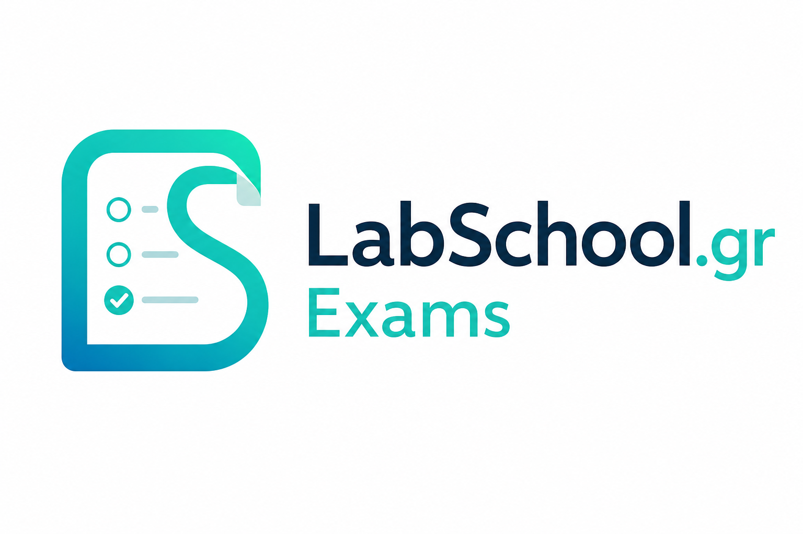

<p align="center">
  
</p>

# LabSchool Exams

[](https://github.com/LabSchool-GR/Exams/tags)
[](https://github.com/LabSchool-GR/Exams/blob/main/LICENSE.md)
[](https://github.com/LabSchool-GR/Exams/actions/workflows/tests.yml)

## Ελληνικά

Το **LabSchool Exams** είναι εφαρμογή αξιολόγησης γνώσεων ανοιχτού κώδικα, βασισμένη στο Laravel. Απευθύνεται σε σχολεία, φορείς κατάρτισης και εκπαιδευτικές δράσεις που χρειάζονται δημιουργία quiz, συμμετοχή εξεταζόμενων, αποτελέσματα, στατιστικά, PDFs και βεβαιώσεις.

Οι εξεταζόμενοι δεν χρειάζεται να δημιουργούν λογαριασμό. Μπορούν να συμμετέχουν με προσωρινό PIN, προσωπικό σύνδεσμο ή άλλη ροή που έχει ορίσει ο δημιουργός του quiz.

**Βασικά σημεία**

- Δημιουργία και επεξεργασία quiz.
- Ερωτήσεις μονής ή πολλαπλής σωστής απάντησης.
- Διαχείριση εξεταζόμενων, PIN, προσωπικών συνδέσμων και ανώνυμων ροών.
- Πρότυπα εμφάνισης quiz.
- Αποτελέσματα, στατιστικά, εξαγωγές, PDFs και βεβαιώσεις.
- Ρόλοι εκπαιδευτικών και διαχειριστών.
- Έλεγχοι ασφάλειας, privacy και λειτουργικής διαχείρισης.

**Οδηγοί και σελίδες**

- [Αρχική σελίδα τεκμηρίωσης](docs/index.html)
- [Οδηγός χρήσης](docs/learn.html)
- [Εγκατάσταση και ρύθμιση](docs/Installation-and-Setup.html)
- [Αναβάθμιση](docs/upgrade-packages.html)
- [Ασφάλεια, απόρρητο και συμμόρφωση](docs/Security-Privacy-and-Compliance.html)
- [Υποστήριξη έργου](docs/sponsor.html)

## English

**LabSchool Exams** is an open-source Laravel application for knowledge assessment. It is designed for schools, training organizations, and educational activities that need quiz creation, participant flows, results, statistics, PDFs, and certificates.

Participants do not need to create an account. They can join with a temporary PIN, a personalized link, or another access flow configured by the quiz creator.

**Core features**

- Quiz creation and editing.
- Single-answer and multiple-answer questions.
- Examinee management, PIN access, personalized links, and anonymous flows.
- Quiz display templates.
- Results, statistics, exports, PDFs, and certificates.
- Teacher and administrator roles.
- Security, privacy, and operational controls.

**Documentation**

- [Documentation home](docs/index.html)
- [User guide](docs/learn.html)
- [Installation and setup](docs/Installation-and-Setup.html)
- [Upgrade packages](docs/upgrade-packages.html)
- [Security, privacy and compliance](docs/Security-Privacy-and-Compliance.html)
- [Support the project](docs/sponsor.html)

## Quick Local Setup

```bash
composer install
npm install
cp .env.example .env
php artisan app:install
npm run build
php artisan serve
```

Open `http://127.0.0.1:8000` and sign in with the administrator account created during installation.

## Technology

- PHP 8.2+
- Laravel 12
- MySQL/MariaDB or SQLite
- Vite and npm
- DomPDF
- Laravel Excel
- Pest/PHPUnit

## License

This project is licensed under the GNU Affero General Public License v3.0 or later.

See [LICENSE.md](LICENSE.md) for the full legal text.

## Credits

Developed by Dimitrios Kanatas for LabSchool.gr.
