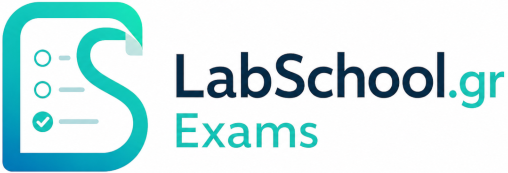

<p align="center">
  
</p>

<h1 align="center">LabSchool Exams</h1>

<p align="center">
  <strong>Open-source knowledge assessment for schools, training teams, and educational communities.</strong><br>
  <strong>Ανοιχτού κώδικα εφαρμογή αξιολόγησης γνώσεων για σχολεία, φορείς κατάρτισης και εκπαιδευτικές δράσεις.</strong>
</p>

<p align="center">
  <a href="https://github.com/LabSchool-GR/Exams/tags"></a>
  <a href="LICENSE.md"></a>
  <a href="https://github.com/LabSchool-GR/Exams/actions/workflows/tests.yml"></a>
</p>

---

## Ελληνικά

Το **LabSchool Exams** είναι μια εκπαιδευτική εφαρμογή αξιολόγησης γνώσεων, βασισμένη στο Laravel. Σχεδιάστηκε για εκπαιδευτικούς που θέλουν να δημιουργούν δοκιμασίες, να οργανώνουν συμμετέχοντες, να παρακολουθούν αποτελέσματα και να παράγουν αναφορές χωρίς περίπλοκη τεχνική διαδικασία.

Οι εξεταζόμενοι δεν χρειάζεται να έχουν λογαριασμό. Μπορούν να συμμετέχουν με προσωρινό PIN, προσωπικό σύνδεσμο ή δημόσια/ανώνυμη ροή, ανάλογα με τον τρόπο που έχει ορίσει ο δημιουργός του quiz.

### Τι προσφέρει;

- Δημιουργία quiz με ερωτήσεις μονής ή πολλαπλής σωστής απάντησης.
- Διαχείριση μαθητών, εξεταζόμενων, επισκεπτών και ανώνυμων συμμετοχών.
- Προσωπικοί σύνδεσμοι, PIN πρόσβασης και δημόσιες ροές συμμετοχής.
- Πρότυπα εμφάνισης quiz για διαφορετικές εκπαιδευτικές ανάγκες.
- Αποτελέσματα, στατιστικά ερωτήσεων, εξαγωγές, PDFs και βεβαιώσεις.
- Ρόλοι εκπαιδευτικών και διαχειριστών με ελεγχόμενη πρόσβαση.
- Οδηγός χρήσης και σελίδες τεκμηρίωσης για εγκατάσταση, αναβάθμιση και ασφάλεια.

### Γρήγορη πλοήγηση

| Ενότητα | Σύνδεσμος |
| --- | --- |
| Αρχική τεκμηρίωση | [Άνοιγμα](https://labschool-gr.github.io/Exams/) |
| Οδηγός χρήσης | [Άνοιγμα](https://labschool-gr.github.io/Exams/learn.html) |
| Εγκατάσταση | [Άνοιγμα](https://labschool-gr.github.io/Exams/Installation-and-Setup.html) |
| Αναβάθμιση | [Άνοιγμα](https://labschool-gr.github.io/Exams/upgrade-packages.html) |
| Ασφάλεια και απόρρητο | [Άνοιγμα](https://labschool-gr.github.io/Exams/Security-Privacy-and-Compliance.html) |
| Υποστήριξη έργου | [Άνοιγμα](https://labschool-gr.github.io/Exams/sponsor.html) |

---

## English

**LabSchool Exams** is an educational knowledge-assessment application built with Laravel. It helps teachers and training teams create quizzes, organize participants, review results, and generate useful reports without turning assessment into a technical burden.

Participants do not need an account. They can join with a temporary PIN, a personalized link, or a public/anonymous flow, depending on the process configured by the quiz creator.

### Highlights

- Quiz authoring with single-answer and multiple-answer questions.
- Student, examinee, guest, and anonymous participation workflows.
- Personalized links, PIN access, and public participation flows.
- Quiz display templates for different educational scenarios.
- Results, question statistics, exports, PDFs, and certificates.
- Teacher and administrator roles with controlled access.
- Documentation pages for installation, upgrades, security, and everyday use.

### Documentation

| Section | Link |
| --- | --- |
| Documentation home | [Open](https://labschool-gr.github.io/Exams/) |
| User guide | [Open](https://labschool-gr.github.io/Exams/learn.html) |
| Installation | [Open](https://labschool-gr.github.io/Exams/Installation-and-Setup.html) |
| Upgrade packages | [Open](https://labschool-gr.github.io/Exams/upgrade-packages.html) |
| Security and privacy | [Open](https://labschool-gr.github.io/Exams/Security-Privacy-and-Compliance.html) |
| Support the project | [Open](https://labschool-gr.github.io/Exams/sponsor.html) |

---

## Quick Local Setup

```bash
composer install
npm install
cp .env.example .env
php artisan app:install
npm run build
php artisan serve
```

Open `http://127.0.0.1:8000` and sign in with the administrator account created during installation.

## Technology

`PHP 8.2+` · `Laravel 12` · `MySQL/MariaDB` · `SQLite` · `Vite` · `DomPDF` · `Laravel Excel` · `Pest/PHPUnit`

## License

LabSchool Exams is distributed under the **GNU Affero General Public License v3.0 or later**.

See [LICENSE.md](LICENSE.md) for the project license notice. The badge above is static because GitHub only auto-detects licenses when the repository contains a full canonical license text.

## Credits

Developed by **Dimitrios Kanatas** for [LabSchool.gr](https://labschool.gr).
