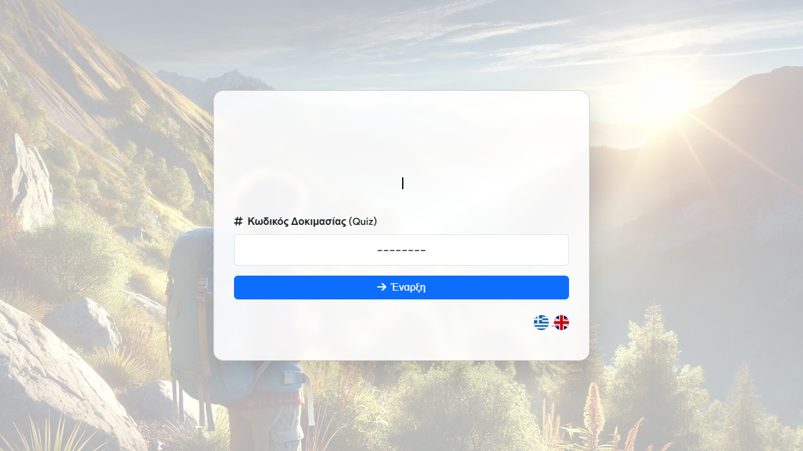
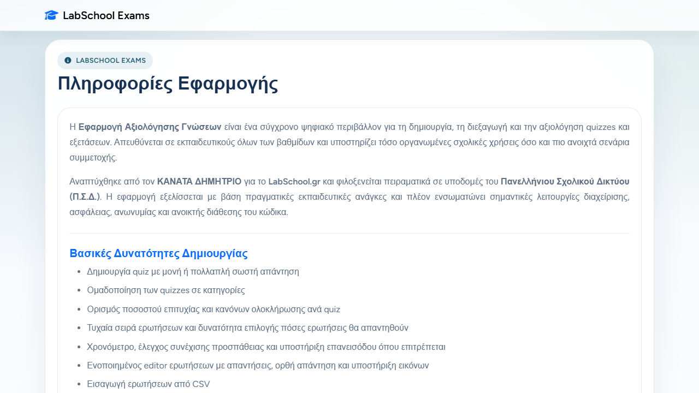
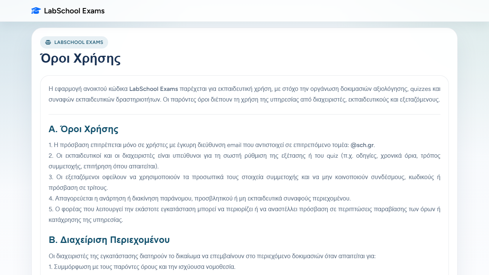
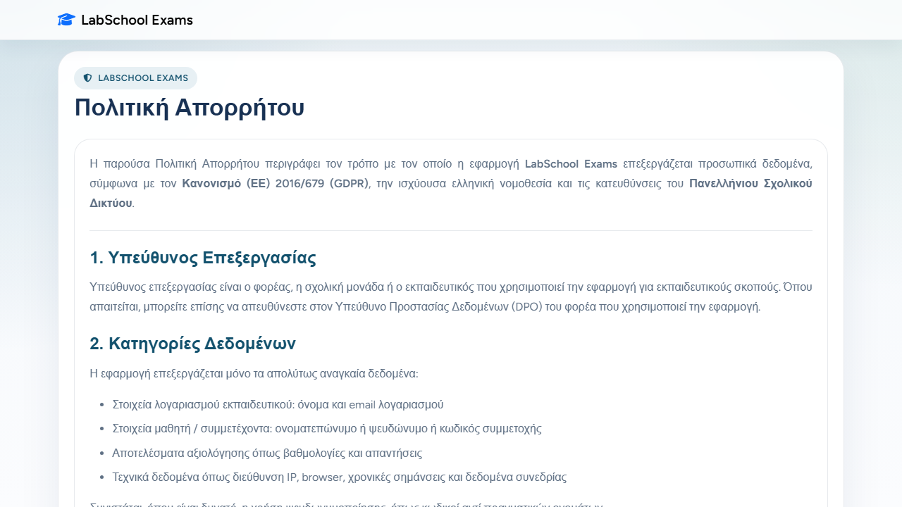
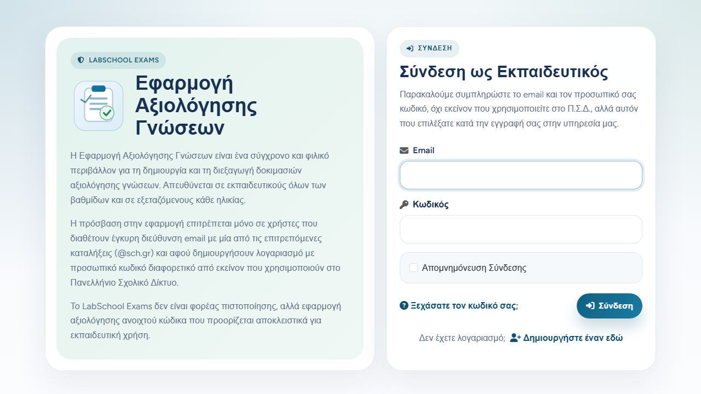

# LabSchool Exams

[](https://github.com/LabSchool-GR/Exams/releases)
[](https://github.com/LabSchool-GR/Exams/blob/main/LICENSE.md)
[](https://github.com/LabSchool-GR/Exams/actions/workflows/tests.yml)

Educational quiz and assessment platform built with Laravel for schools, training organizations, and blended-learning scenarios.

Πλατφόρμα δημιουργίας quizzes και αξιολόγησης γνώσεων, βασισμένη στο Laravel, για σχολικές μονάδες, φορείς κατάρτισης και μικτά σενάρια μάθησης.

## Quick Start (60 sec)

```bash
composer install ; npm install ; cp .env.example .env ; php artisan key:generate ; php artisan migrate ; php artisan app:setup-admin ; php artisan db:seed ; php artisan storage:link ; npm run build ; php artisan serve
```

Open `http://127.0.0.1:8000` and sign in with your admin account.

## Quick Navigation

- Greek summary: [Ελληνική Παρουσίαση](#ελληνική-παρουσίαση)
- English summary: [English Overview](#english-overview)
- Screenshots: [Βασικές Οθόνες / Key Screenshots](#βασικές-οθόνες--key-screenshots)
- Installation: [Εγκατάσταση / Installation](#εγκατάσταση--installation)
- Operations: [Λειτουργία Παραγωγής / Production Operations](#λειτουργία-παραγωγής--production-operations)
- Legal and privacy: [Όροι, Απόρρητο και Συμμόρφωση / Terms, Privacy and Compliance](#όροι-απόρρητο-και-συμμόρφωση--terms-privacy-and-compliance)

## Βασικές Οθόνες / Key Screenshots

### 1. Quiz Join



### 2. About Page



### 3. Terms of Use



### 4. Privacy Policy



### 5. Login



## Ελληνική Παρουσίαση

Το LabSchool Exams είναι ένα ολοκληρωμένο περιβάλλον για:

- σχεδίαση και οργάνωση quizzes
- συμμετοχή εξεταζομένων με πολλαπλά μοντέλα πρόσβασης
- εξαγωγή αναφορών, στατιστικών και πιστοποιητικών
- ασφαλή διαχείριση δεδομένων και συμμόρφωση με τις απαιτήσεις GDPR

Η εφαρμογή υποστηρίζει τόσο κλειστές εκπαιδευτικές ροές (με λογαριασμούς και κωδικούς) όσο και πιο ανοιχτές ροές (επισκέπτες, δημόσιος κατάλογος, ανώνυμη συμμετοχή), με ελεγχόμενα δικαιώματα ανά ρόλο.

### Βασικές Δυνατότητες

1. Δημιουργία quizzes με μονή ή πολλαπλή σωστή απάντηση.
2. Κατηγοριοποίηση quizzes και οργάνωση συλλογών.
3. Εισαγωγή ερωτήσεων από CSV.
4. Διαχείριση εξεταζομένων με χειροκίνητη καταχώριση ή CSV import.
5. Συμμετοχή επισκεπτών όπου επιτρέπεται, με ελεγχόμενους υπογεγραμμένους συνδέσμους.
6. Δημόσιος κατάλογος quizzes με δυνατότητα άμεσης εκκίνησης.
7. Στατιστικά ανά ερώτηση και εξαγωγές σε Excel/PDF.
8. Πιστοποιητικά επιτυχίας PDF και δημόσια επαλήθευση με signed URL.
9. Ρόλοι χρηστών, όρια χρήσης και ροή αιτημάτων αύξησης ορίων.
10. Πολιτικές ασφαλείας (rate limiting, security headers, CSP, pruning προσωπικών δεδομένων).

### Σελίδες Πληροφοριών Εφαρμογής

Η εφαρμογή περιλαμβάνει έτοιμες σελίδες που ενημερώνουν τελικούς χρήστες και φορείς:

- Πληροφορίες: [resources/views/about.blade.php](resources/views/about.blade.php)
- Όροι Χρήσης: [resources/views/terms.blade.php](resources/views/terms.blade.php)
- Πολιτική Απορρήτου: [resources/views/privacy.blade.php](resources/views/privacy.blade.php)

Οι αντίστοιχες δημόσιες διαδρομές είναι:

- /about
- /terms
- /privacy

## English Overview

LabSchool Exams is a full-featured assessment platform for:

- authoring and managing quizzes
- running participant flows with multiple access models
- exporting analytics, reports, and certificates
- applying privacy-aware and security-first operational controls

The platform supports both closed educational workflows (accounts and participant codes) and open scenarios (guest participation, public catalogue access, anonymous flows), with role-based governance.

### Core Capabilities

1. Quiz authoring with single or multiple correct answers.
2. Quiz categorization and collection management.
3. CSV question import.
4. Participant registration and CSV-based onboarding.
5. Signed-link guest participation where enabled.
6. Public quiz catalogue for direct guest starts.
7. Question-level analytics and Excel/PDF exports.
8. PDF success certificates plus signed public verification.
9. User roles, usage quotas, and quota request workflows.
10. Security controls (throttling, security headers, CSP, personal-data pruning).

## Technology Stack

- PHP 8.2+
- Laravel 12
- MySQL/MariaDB-compatible relational database
- Vite + npm frontend pipeline
- DomPDF for PDF rendering
- Laravel Excel for XLSX exports
- Pest/PHPUnit for automated testing

## Εγκατάσταση / Installation

### Προαπαιτούμενα / Prerequisites

- PHP 8.2+
- Composer
- Node.js + npm
- Database server (MySQL/MariaDB)

### Βήματα Τοπικής Εγκατάστασης / Local Setup Steps

```bash
composer install
npm install
cp .env.example .env
php artisan key:generate
php artisan migrate
php artisan app:setup-admin
php artisan db:seed
php artisan storage:link
npm run build
php artisan serve
```

### Προαιρετικά Seeds για demo/dev / Optional demo/dev seed layers

```bash
# Demo dataset (safe for repeatable previews if an admin already exists)
APP_SEED_DEMO=true php artisan db:seed

# Local-only dev helpers
APP_SEED_DEV=true php artisan db:seed
```

### Frontend Development Mode

```bash
npm run dev
```

## Testing and Quality

### Automated tests

```bash
php artisan test
```

### Manual regression references

- [docs/manual-test-matrix.md](docs/manual-test-matrix.md)
- [docs/quiz-template-smoke-checklist.md](docs/quiz-template-smoke-checklist.md)

CI test workflow: [.github/workflows/tests.yml](.github/workflows/tests.yml)

## Λειτουργία Παραγωγής / Production Operations

### Recommended production baseline

- APP_ENV=production
- APP_DEBUG=false
- APP_SOURCE_URL=https://github.com/LabSchool-GR/Exams
- HTTPS enabled at proxy/server layer
- writable storage/ and bootstrap/cache/
- active queue worker for queued mail
- active scheduler cron job

### Deployment command sequence

```bash
composer install --no-dev --prefer-dist --optimize-autoloader
npm ci
npm run build
php artisan migrate --force
php artisan app:setup-admin
php artisan db:seed
php artisan storage:link
php artisan config:cache
php artisan route:cache
php artisan view:cache
```

### Scheduler entry

```cron
* * * * * php /path/to/artisan schedule:run >> /dev/null 2>&1
```

Current scheduled maintenance commands:

- php artisan quiz-attempts:expire
- php artisan privacy:prune-exam-personal-data

Full operations checklist: [docs/runbook.md](docs/runbook.md)

## Όροι, Απόρρητο και Συμμόρφωση / Terms, Privacy and Compliance

Η εφαρμογή έχει σχεδιαστεί με έμφαση σε εκπαιδευτική δεοντολογία, ασφάλεια και προστασία προσωπικών δεδομένων.

The application is designed with educational governance, security, and data-protection principles in mind.

### Τι καλύπτεται / What is covered

1. Όροι χρήσης για εκπαιδευτικούς, διαχειριστές και εξεταζόμενους.
2. Περιορισμός πρόσβασης με επιτρεπόμενα email domains (όπου έχει ρυθμιστεί).
3. Privacy policy aligned with GDPR principles and retention controls.
4. Security measures such as signed URLs, throttling, secure sessions, and hardened headers.
5. Open-source obligations and source-availability model for hosted AGPL deployments.

Source pages and legal text resources:

- [resources/views/about.blade.php](resources/views/about.blade.php)
- [resources/views/terms.blade.php](resources/views/terms.blade.php)
- [resources/views/privacy.blade.php](resources/views/privacy.blade.php)
- [resources/lang/el/about.php](resources/lang/el/about.php)
- [resources/lang/el/terms.php](resources/lang/el/terms.php)
- [resources/lang/el/privacy.php](resources/lang/el/privacy.php)
- [resources/lang/en/about.php](resources/lang/en/about.php)
- [resources/lang/en/terms.php](resources/lang/en/terms.php)
- [resources/lang/en/privacy.php](resources/lang/en/privacy.php)

## Security Notes

- DomPDF embedded PHP execution is disabled by design.
- Content-Security-Policy is enforcing by default.
- You can temporarily switch to report-only mode with SECURITY_CSP_REPORT_ONLY=true for rollout diagnostics.

## License

This project is licensed under GNU Affero General Public License, version 3 or any later version (AGPL-3.0-or-later).

If you deploy a modified network-accessible version, you must provide the corresponding source code to users of that service under the same license terms.

See [LICENSE.md](LICENSE.md) for full legal text.

## Credits

Developed by Dimitrios Kanatas for LabSchool.gr.
